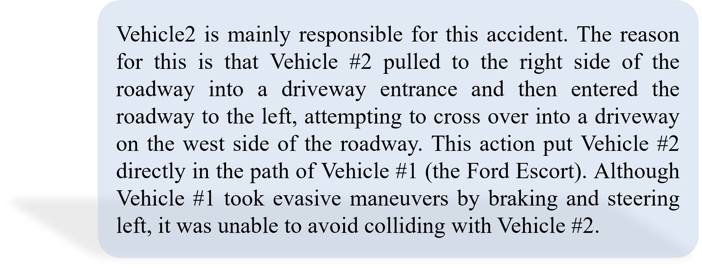
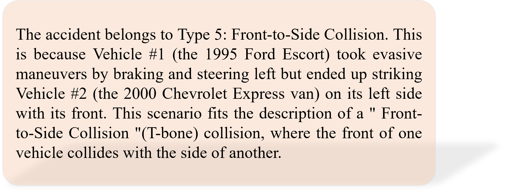
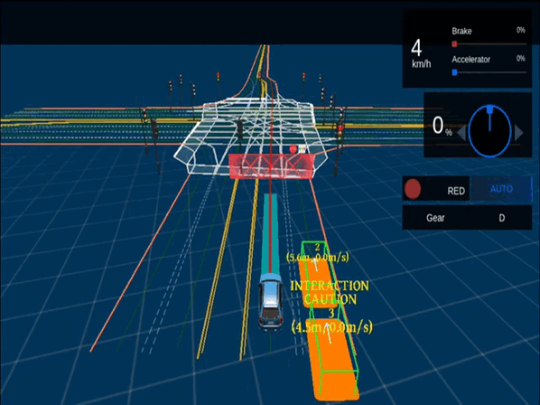
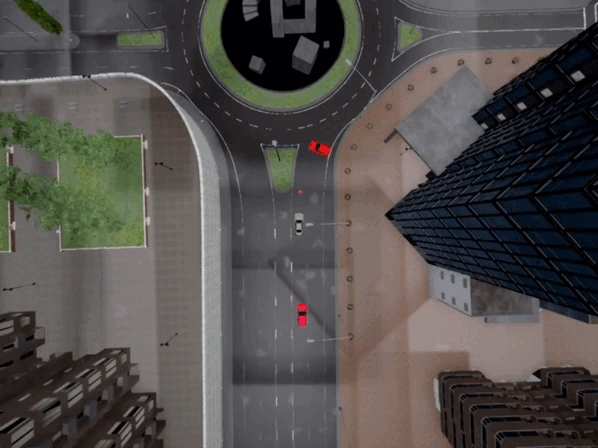

Simulation testing has been widely adopted by leading companies to ensure the safety of autonomous driving systems (ADSs). A number of scenario-based testing approaches have been developed to generate diverse driving scenarios for simulation testing, and demonstrated to be capable of finding safety violations. However, there is no automated way to diagnose whether these violations are caused by the ADS under test and which category these violations belong to. As a result, great effort is required to manually diagnose violations.

To bridge this gap, we propose DiaVio to automatically diagnose safety violations in simulation testing by leveraging large language models (LLMs). It is built on top of a new domain specific language (DSL) of crash to align real-world accident reports described in natural language and violation scenarios in simulation testing. DiaVio fine-tunes a base LLM with real-world accident reports to learn diagnosis capability, and uses the fine-tuned LLM to diagnose violation scenarios in simulation testing. Our evaluation has demonstrated the effectiveness and efficiency of DiaVio in violation diagnosis.

The paper has been submitted to ISSTA 2024.

## Overview


## The prototype of DiaVio and documents are available [here](https://github.com/DiaVio/diavio).

## The LoRA models and datasets are available [here](https://huggingface.co/DiaVio).

## The Syntax of Crash DSL

We propose a DSL to describe crashes. The DSL serves as an intermediate representation to align crashes in accident reports in natural language and crashes in violation scenarios in simulation testing. The syntax of our proposed Crash DSL is illustrated as follows.


## Accident Reports --- Violation Reports --- Model Output

Here we will introduce the format of the accident reports, the style of the violation reports and the results of the model diagnosis.

### Accident Reports

Here is a piece of data in NMVCCS dataset.

| Para | Description                                                  | Use                                                          |
| --------- | ------------------------------------------------------------ | ------------------------------------------------------------ |
| 1         | The crash occurred on a two lane undivided level roadway with a posted speed limit of 30 mph (48 kph) on a weekday evening. It was raining, the roadway was wet and it was dark, but lighted at the time of the crash. | Extract road and environmental information                   |
| 2         | Vehicle #1, a 1995 Ford Escort and Vehicle #2, a 2000 Chevrolet Express van, were traveling north on the roadway. Vehicle #2 was ahead of Vehicle #1. Vehicle #2 pulled to the right side of the roadway into a driveway entrance. Vehicle #2 then entered the roadway to the left and attempted to cross over into a driveway on the west side of the roadway. Vehicle #1 took evasive maneuvers by braking and steering left. Vehicle #1 struck Vehicle #2 in the left side with its front. Both vehicles came to rest on the roadway. Police Reported Travel Speed is Not reported for V1 and Not reported for V2. | Extract vehicle information                                  |
| 3         | The Ford Escort (Vehicle #1, blue) was driven by a 17-year-old male who was transported, treated for a complaint of pain and released from a local hospital. The 15-year-old female passenger was not injured. There was no interview obtained. Vehicle #1 was towed due to damage.<br/><br/>The Critical Precrash Event for Vehicle #1 was when Vehicle #2 entered the roadway from the driveway across Vehicle #1's path. The Critical Reason for the Critical Event was not coded to this vehicle. It is possible that the driver of Vehicle #1 made a false assumption that Vehicle #2 would remain on the shoulder as he passed. An associated factor coded to this driver was the use of prescription medications. He was taking two medications, Triclor and HCTZ.<br/><br/>The Chevrolet Express van (Vehicle #2, white) was driven by a 23-year-old male who was transported for a complaint of pain, treated and released from a local hospital. The 45-year-old male passenger was not injured. There was no interview obtained, only a few details from the passenger. Vehicle #2 was driven from the scene.<br/><br/>The Critical Precrash Event for Vehicle #2 was when this vehicle turned left across the path of Vehicle #1. The Critical Reason for the Critical Event for this vehicle was an unknown type of driver error. It is possible that due to the darkness and weather conditions that the driver did not see or misjudged the approach of Vehicle #1. The passenger advised that driver was turning left into the deli parking lot. They had been working on-call and had been fixing a heating system, so it may also be possible that the driver had been fatigued. No other associated factors were coded to this driver. | Liability determination and crash classification and their causes |


### Violation Reports

Based on the above accident report, we convert its format according to the syntax of the DSL (aligned with the violation report generated during the simulation testing).

```json
{
    "Road": {
        "RoadType": "undivided driveway",
        "LaneType": "two lane",
        "RoadShape": "straight",
        "RoadSlope": "level",
        "SpeedLimit": 30
    },
    "Environment": {
        "RoadCondition": "wet",
        "Weather": "rainy",
        "TrafficSignals": "unmentioned"
    },
    "Obstacles": {
        "Type": "unmentioned",
        "Location": "unmentioned"
    },
    "Vehicle1": {
        "ImpactSide": "front",
        "MovingOnWhichWay": "lane1",
        "LocationAfterCrash": "rested on the roadway",
        "Behavior": {
            "WhetherToBrake": "yes",
            "Direction": "north",
            "VehicleAction": "going straight, steering left",
            "TravelSpeed": "unmentioned",
            "IsAgainstRules": "no",
            "AttemptedAvoidanceManeuvers": "yes",
            "AttemptedLaneCrossing": "no"
        }
    },
    "Vehicle2": {
        "ImpactSide": "left",
        "MovingOnWhichWay": "lane1",
        "LocationAfterCrash": "rested on the roadway",
        "Behavior": {
            "WhetherToBrake": "unmentioned",
            "Direction": "north",
            "VehicleAction": "turning left",
            "TravelSpeed": "unmentioned",
            "IsAgainstRules": "no",
            "AttemptedAvoidanceManeuvers": "unmentioned",
            "AttemptedLaneCrossing": "left-change"
        }
    }
}
```


### Model Output

The output of our fine-tuned model diagnosis of the above report are shown below.


| Liability Determination                                      | Crash Classification                                         |
| ------------------------------------------------------------ | ------------------------------------------------------------ |
|    |  |


## Samples

By running DiaVio with AV-Fuzzer and DriveFuzz, we diagnose cases caused by NPC Vehicles and Ego Vehicle respectively. Here are some examples of our findings.

<table>
  <tr>
    <td>
      
      <p align="center">Caused by Ego (AV-Fuzzer)</p>
    </td>
    <td>
      
      <p align="center">Caused by NPC (AV-Fuzzer)</p>
    </td>
  </tr>
  <tr>
    <td>
      
      <p align="center">Caused by Ego (DriveFuzz)</p>
    </td>
    <td>
      
      <p align="center">Caused by NPC (DriveFuzz)</p>
    </td>
  </tr>
</table>

**The Effect of DiaVio when running**


